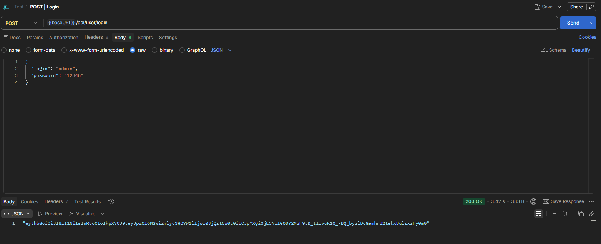
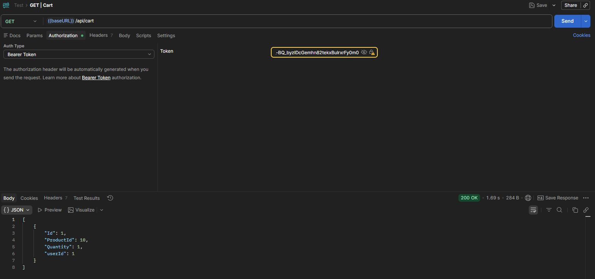

# JWT-авторизация




## `User.js`

```js
const express = require('express');
const { sequelize } = require('../models');
const { QueryTypes } = require('sequelize');

const md5 = require('md5');
const jwt = require('jsonwebtoken');
const JWT_SECRET = process.env.JWT_SECRET

const router = express.Router();

router.post('/login', async (req, res) => {
  try {
    const user = await sequelize.query(`
      SELECT *
      FROM User
      WHERE login=:login
    `, {
      plain: true,
      logging: false,
      type: QueryTypes.SELECT,
      replacements: {
        login: req.body.login
      }
    })

    if (user) {
      const passwordMD5 = md5(req.body.password)
      if (user.password == passwordMD5) {
        const jwtToken = jwt.sign({
            id: user.id, 
            firstName: user.firstName,
            roleId: user.roleId 
          }, 
          JWT_SECRET
        )

        res.json(jwtToken)
      } else {
        res.status(401).send('не верный пароль')
      }
    } else {
      res.status(404).send('пользователь не найден')
    }
  } catch (error) {
    console.warn('ошибка при авторизации:', error.message)
    res.status(500).send(error.message)
  } finally {
    res.end()
  }
})

module.exports = router;
```

---

## `Cart.js`

```js
const express = require('express');
const { sequelize } = require('../models');
const { QueryTypes } = require('sequelize');

const jwt = require('jsonwebtoken');
const JWT_SECRET = process.env.JWT_SECRET || 'secret_key';

const router = express.Router();

const authenticateJWT = (req, res, next) => {
  const authHeader = req.headers.authorization

  if (authHeader) {
    const token = authHeader.split(' ')

    if (token[0].toLowerCase() != 'bearer')
      return res.status(400).send('не поддерживаемый тип авторизации')

    jwt.verify(token[1], JWT_SECRET, (err, data) => {
      if (err) return res.status(403).send(err)

      req.user = data
      next()
    })
  } else {
    res.status(401).send('нет заголовка авторизации')
  }
}

router.post('/', async function(req, res) {
  try {
    await sequelize.query(`
      INSERT INTO Cart (productId, quantity)
      VALUES (:productId, :quantity)
    `,{
      logging: false,
      type: QueryTypes.INSERT,
      replacements: {
        productId: req.body.productId,
        quantity: req.body.quantity
      }
    })
    res.status(201)
  } catch (error) {
    console.warn('ошибка при добавлении блюда в корзину:', error.message)
    res.status(500).send(error.message)
  } finally {
    res.end()
  }
})

router.get('/', [authenticateJWT], async (req, res) => {
  try {
    res.json(await sequelize.query(`
      SELECT *
      FROM Cart
      WHERE userId=:userId
    `, {
      logging: false,
      type: QueryTypes.SELECT,
      replacements: {
        userId: req.user.id
      }
    }))
  } catch (error) {
    console.error(error)
  } finally {
    res.end()
  }
})

router.patch('/:id(\\d+)', async (req, res) => {
  try {
    await sequelize.query(`
      UPDATE Cart 
      SET quantity=:quantity
      WHERE id=:id
    `,{
      logging: false,
      replacements: {
        id: req.params.id,
        quantity: req.body.quantity
      }
    })
  } catch (error) {
    console.warn('ошибка при редактировании корзины:', error.message)
    res.status(500).send(error.message)
  } finally {
    res.end()
  }
})

router.delete('/:id(\\d+)', async (req, res) => {
  try {
    await sequelize.query(`
      DELETE 
      FROM Cart
      WHERE id=:id
    `,{
      logging: false,
      replacements: {
        id: req.params.id
      }
    })
  } catch (error) {
    console.warn('ошибка при удалении блюда из корзины:', error.message)
    res.status(500).send(error.message)
  } finally {
    res.end()
  }
}) 

module.exports = router;
```

---

## `app.js`

```js
const express = require('express');

const productRouter = require('./routes/Products');
const cartRouter = require('./routes/Cart');
const userRouter = require('./routes/User');

const port = 3000;
const app = express()

app.use(express.json())

app.use('/api/products', productRouter);
app.use('/api/cart', cartRouter);
app.use('/api/user', userRouter);

app.listen(port, () => {
    console.log(`Example app listening on port ${port}`);
});
```